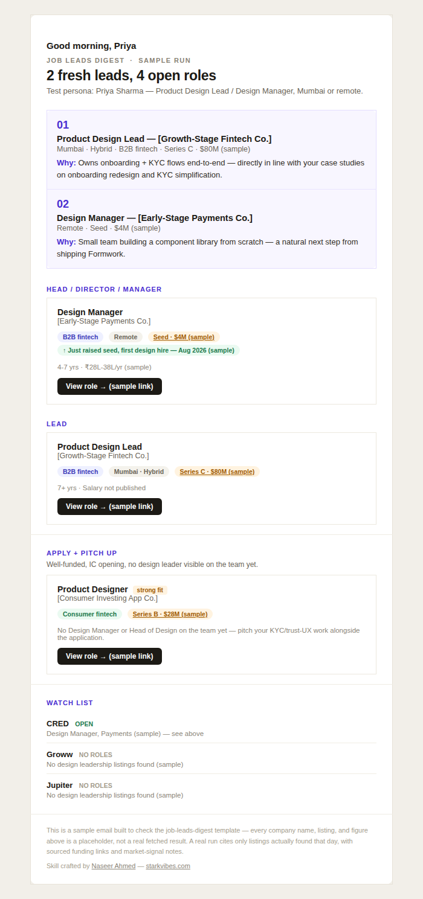

# Job Leads Digest

A Claude skill that sets up a personalized, recurring job-leads email digest for any career function — design, sales, engineering, marketing, ops, whatever the candidate does. Sourced live from job boards and funding news, matched against the candidate's own resume and proof-of-work (portfolio, GitHub, LinkedIn, or described achievements), deduped over time, and delivered as a clean, card-based HTML email on a schedule they pick.

## What it does

- Interviews a candidate once (field, target titles, locations, funding-stage preference, resume, proof-of-work, delivery schedule, watch list) and turns that into a standing scheduled task.
- Every run: searches known-reliable job boards, cross-checks recent funding and company news (layoffs, hiring surges), dedupes against everything already sent, and grounds its "why this fits you" reasoning in specifics from the candidate's actual resume and proof-of-work — never generic phrasing.
- Sorts findings into direct-fit roles, an "Apply + pitch up" bucket (well-funded companies with an IC opening and no leader in the candidate's function yet), and cold-outreach targets.
- Emails the result as a personally-greeted, card-based HTML digest — sourced funding figures, market-signal chips, stage-grouped listings, all built to survive Gmail's mobile app (which strips `<style>` blocks — every style here is inlined for that reason).

## How to use it

1. **Install the skill.** Two ways:
   - **As a plugin (recommended):** in Claude Code, run `/plugin marketplace add nastarkk/job-leads-digest` then `/plugin install job-leads-digest@job-leads-digest`.
   - **Manual copy:** copy `plugins/job-leads-digest/skills/job-leads-digest/` into your Claude skills directory (typically `.claude/skills/job-leads-digest/`).
2. **Ask for it.** In a session with scheduled-task support, just say something like *"set up a job digest for me"* or *"email me new sales leadership roles weekly."* No slash command needed — the skill triggers on intent.
3. **Answer the interview.** Claude will ask, one or two at a time: your field/function, target titles, locations, funding-stage preference, your resume (attach it), your best proof-of-work link (portfolio, GitHub, LinkedIn — whatever fits your field), delivery email + schedule, and any companies you want on a standing watch list.
4. **Confirm the profile.** Claude shows back what it extracted before scheduling anything — this is your chance to correct anything before it becomes a recurring task.
5. **It's live.** A scheduled task now runs on your account. Every firing researches fresh, dedupes against what you've already seen, and emails you the result. Ask for it again later to adjust criteria, schedule, or watch list — no need to start over.

### What the email looks like

Every candidate gets a personally-greeted, card-based digest — grouped by seniority tier and funding stage, funding figures linked to their source, market-signal chips (layoffs, hiring surges) only when something real was found, and an "Apply + pitch up" section for well-funded companies with an opening but no leader in your function yet.

Below is a sample for a fictional product designer — illustrative data only, not a real run:



## Structure

```
job-leads-digest/                              — this repo doubles as a plugin marketplace
├── .claude-plugin/
│   └── marketplace.json                       — marketplace catalog (lists the plugin below)
├── plugins/
│   └── job-leads-digest/
│       ├── .claude-plugin/
│       │   └── plugin.json                    — plugin manifest
│       └── skills/
│           └── job-leads-digest/
│               ├── SKILL.md                   — setup + scheduled-run instructions
│               └── references/
│                   ├── search-sources.md       — which job boards work, their quirks
│                   └── email-design.md         — the email's visual/HTML spec
└── assets/
    └── demo-email.png                         — sample output shown above
```

Note: the email header is intentionally text-only, no logo. An earlier version included one, but Gmail (and most clients) block external images by default from a sender the recipient hasn't emailed before — that would've meant most candidates' first digest arrived with a broken image unless they went and changed a setting first. Not worth the friction for a tool meant to just work.

## Using this with other AI tools

This is packaged as a Claude Skill — a format Claude Code, Cowork, and claude.ai know how to auto-load. Other tools (ChatGPT, Gemini, etc.) don't recognize `SKILL.md`, so dropping this repo into one of them won't do anything on its own.

The content itself isn't Claude-locked, though — it's plain instructions, not proprietary logic. To rebuild this workflow on another tool, by hand:

- Paste `SKILL.md`'s content into a Custom GPT's instructions (or an equivalent system-prompt field elsewhere).
- ChatGPT has its own **Scheduled Tasks** feature for the recurring-run part — the mechanism differs from Claude's, but the "run this daily/weekly" piece is doable there too.
- Two gaps to fill yourself: ChatGPT's scheduled tasks don't send email natively (you'd need a Gmail Action or something like Zapier), and web browsing during a task depends on your sandbox/network permissions being enabled — neither is guaranteed out of the box the way Claude's WebFetch/WebSearch and Gmail connector are here.

So: not a one-click port, but the `references/` files (sourcing rules, email design spec) are just as useful as a spec to hand-adapt regardless of which AI tool ends up running it.

---

Skill crafted by [Naseer Ahmed](https://www.linkedin.com/in/nastweets/) — [starkvibes.com](https://starkvibes.com/)
